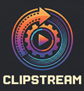

<p align="center">
  
</p>

# ClipStream

**Automate adding intro videos to your YouTube content and re-uploading to your channel.**

[](https://opensource.org/licenses/MIT)
[](https://www.python.org/downloads/)

## Features

- **Add Intros Automatically** - Stitch your custom intro to any video
- **Batch Processing** - Process entire playlists at once
- **YouTube Integration** - Download from and upload to YouTube seamlessly
- **Privacy Controls** - Upload as private for review before publishing
- **Token Caching** - Authenticate once, use repeatedly

## Quick Start

### Prerequisites

- Python 3.10+
- Google Cloud Project with YouTube Data API v3 enabled
- OAuth 2.0 credentials (Desktop App)

### Installation

1. **Clone the repository**
   ```bash
   git clone https://github.com/koreric75/clipstream.git
   cd clipstream
   ```

2. **Create virtual environment**
   ```bash
   python -m venv .venv
   .venv\Scripts\activate  # Windows
   # or
   source .venv/bin/activate  # Linux/Mac
   ```

3. **Install dependencies**
   ```bash
   pip install -e .
   ```

4. **Configure environment**
   ```bash
   cp .env.example .env
   # Edit .env with your settings
   ```

5. **Add Google OAuth credentials**
   - Go to [Google Cloud Console](https://console.cloud.google.com/)
   - Create OAuth 2.0 credentials (Desktop App)
   - Download and save as `client_secrets.json` in the project root

6. **Add your intro video**
   - Place your intro video as `intro.mp4` in the project root
   - Or update `INTRO_VIDEO` path in `.env`

## Usage

### Interactive Mode

```bash
python main.py
```

Options:
1. **Process a single video** - Add intro to a local video file
2. **Process and upload** - Add intro and upload to YouTube
3. **List your videos** - View recent uploads on your channel
4. **Exit**

### Batch Processing

Process multiple videos from a YouTube playlist:

```bash
python batch_process.py "PLAYLIST_URL" --limit 10 --privacy private
```

**Arguments:**
- `PLAYLIST_URL` - YouTube playlist URL
- `--limit, -l` - Number of videos to process (default: 6)
- `--privacy, -p` - Upload privacy: `private`, `unlisted`, or `public` (default: private)

**Example:**
```bash
python batch_process.py "https://www.youtube.com/playlist?list=PLxxxxx" --limit 5 --privacy private
```

## Project Structure

```
youtube_auto_intro/
├── main.py                 # Interactive CLI entry point
├── batch_process.py        # Batch playlist processor
├── pyproject.toml          # Package configuration
├── .env                    # Environment configuration (create from .env.example)
├── .env.example            # Example environment file
├── client_secrets.json     # Google OAuth credentials (not in repo)
├── intro.mp4               # Your intro video (not in repo)
├── token.pickle            # Cached auth token (auto-generated)
├── downloads/              # Downloaded videos (temporary)
├── output/                 # Processed videos with intro
└── yt_automation/          # Core package
    ├── __init__.py
    ├── auth.py             # OAuth authentication
    ├── editor.py           # Video processing (MoviePy)
    └── youtube_ops.py      # YouTube API operations
```

## Configuration

### Environment Variables (.env)

| Variable | Description | Default |
|----------|-------------|---------|
| `CLIENT_SECRETS_FILE` | Path to Google OAuth JSON | `client_secrets.json` |
| `INTRO_VIDEO` | Path to your intro video | `intro.mp4` |
| `OUTPUT_DIR` | Directory for processed videos | `output` |

## API Scopes

This application requests the following YouTube API scopes:
- `youtube.upload` - Upload videos to your channel
- `youtube.readonly` - Read your video list

## Dependencies

- **moviepy** - Video editing and concatenation
- **yt-dlp** - YouTube video downloading
- **google-api-python-client** - YouTube Data API
- **google-auth-oauthlib** - OAuth 2.0 authentication
- **python-dotenv** - Environment configuration

## Troubleshooting

### "Intro video not found"
Ensure `intro.mp4` exists in the project root or update the path in `.env`.

### "Client secrets file not found"
Download OAuth credentials from Google Cloud Console and save as `client_secrets.json`.

### OAuth consent screen error
1. Go to Google Cloud Console > APIs & Services > OAuth consent screen
2. Add your email as a test user
3. Ensure the app is in "Testing" mode

### "localhost failed" during auth
The app will fall back to manual authorization. Copy the URL, authorize in browser, and paste the code back.

## License

MIT License - see [LICENSE](LICENSE) for details.

## Contributing

Contributions are welcome! Please see [CONTRIBUTING.md](CONTRIBUTING.md) for guidelines.

## Author

Created by **BlueFalconInk LLC** for automating YouTube content workflows.

---

<p align="center">
  
  <br>
  <strong>ClipStream</strong> - Streamline Your Content
</p>
